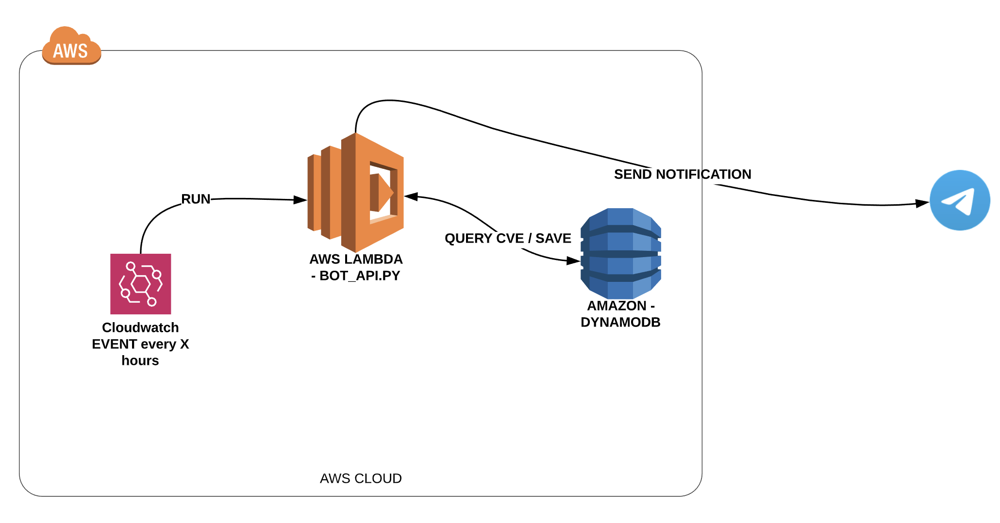

# telegram_bot_cvv
This is the source code of the Telegram BOT for: @SOCHUB > https://t.me/sochub_ar to report CVV from nist API.

## How works

This code works into a `AWS-LAMBDA` and use a `dynamoDB` to store reported CVE's.

## Request New Feature / Fix a BUG
Please feel free to publish or request new features/bugs or use cases, just open a ISSUE into the repo or make a PR.